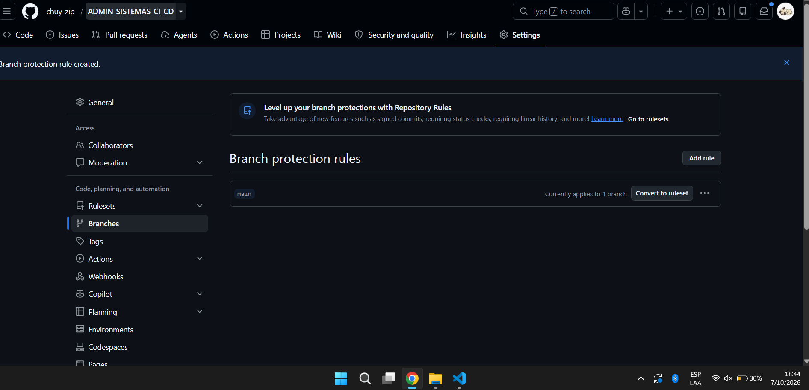

# gh_actions_demo

Sesión Práctica #7 – Continuous Integration (CC3047, UVG).
Librería de manipulación de texto (Opción B) con pruebas unitarias y CI en GitHub Actions.

## Funciones (`manipulacion_texto.py`)

| Función | Descripción |
|---|---|
| `reverse(s)` | Retorna la cadena en orden inverso |
| `count_vowels(s)` | Retorna el total de vocales (incluye acentuadas) |
| `is_palindrome(s)` | Retorna si la cadena es palíndromo (ignora mayúsculas, espacios y signos) |
| `to_upper(s)` | Retorna la cadena en mayúsculas |
| `concat(a, b)` | Retorna la unión de dos cadenas |

Todas lanzan `TypeError` si reciben un valor que no sea `str`.

## Ejecutar las pruebas

```
pip install pytest
python -m pytest -v
```

## Integración continua

El workflow `.github/workflows/ci.yml` corre las pruebas en cada Pull Request hacia `main`.
La rama `main` está protegida: no se puede hacer merge mientras el check `test` no pase.

### Evidencia de la protección de `main`


